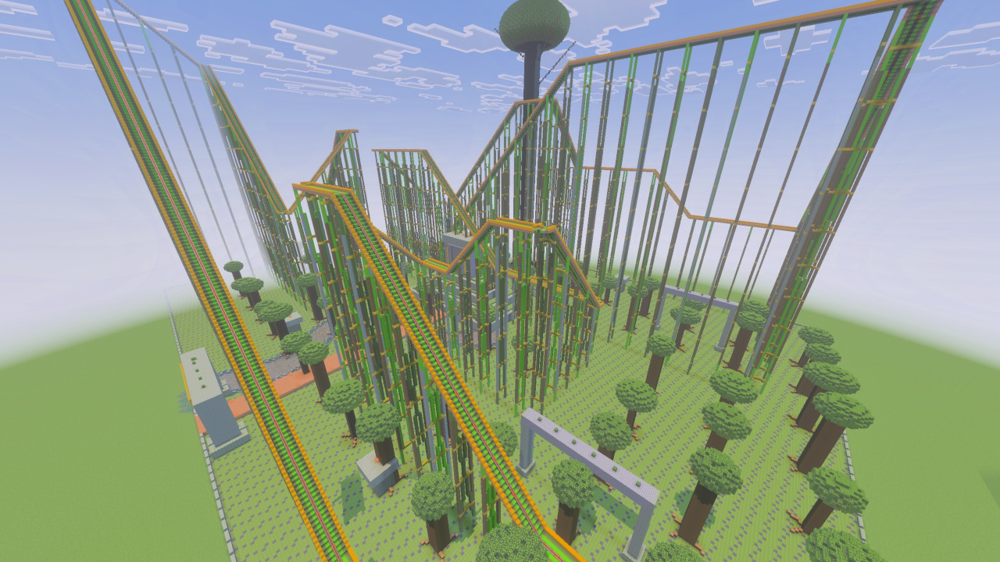
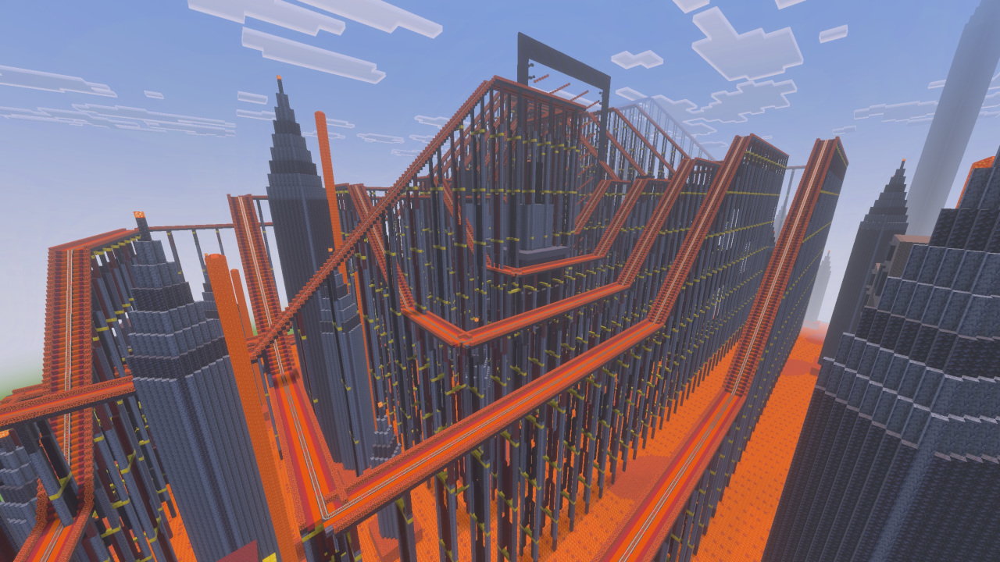

# AI Minecraft Builds

Large language models can generate Minecraft scripts that act as blueprints for buildings and other structures. Describe what you want, ask an LLM for an `.mcfunction` file, and run that function in Minecraft to place the build block by block.

This repository is a collection of those generated blueprints, along with a packaging script that turns them into an `.mcpack` file Minecraft can import.

<p align="center">
  
</p>

<p align="center">
  
</p>

## Example prompt

> build a mcfunction bedrock file for minecraft. make sure to only use bedrock resources. use caret/relative coordinates. commands should build a large, detailed park attraction - roller coaster

## How it works

Minecraft function files are plain-text lists of commands. An LLM can translate a natural-language description into commands such as `fill` and `setblock`, using caret coordinates (`^`) so every block is positioned relative to the player. The result is portable source code for a build: a readable, editable blueprint that Minecraft can execute.

## Huge structure-based roller coasters

The pack includes two enormous, functional roller coasters whose size exceeds Bedrock's 10,000-command function limit. Each ride is divided into 40 sparse native `.mcstructure` assets and placed by a small loader function, preserving the open spaces between the track and scenery instead of filling the entire build volume.

### Jungle Leviathan

<p align="center">
  
</p>

Jungle Leviathan fills a 460 x 313 x 240-block site with 2,320 connected rails, a temple station, river, stepped ruin, waterfalls, and a giant canopy tree. Build it with `/function theme_park_jungle_leviathan_roller_coaster`, then place a minecart on the station track.

### Infernal Rift

<p align="center">
  
</p>

Infernal Rift is a 460 x 313 x 256-block Nether-themed ride with 4,640 connected rails winding around a bastion station, lava sea, portal cathedral, wither gate, and basalt spires. Build it with `/function theme_park_infernal_rift_roller_coaster`, then place a minecart on the station track.

For either coaster, stand at ground level at the front-center of a clear site, face a cardinal direction, and look horizontally. The nearest blocks begin 48 blocks ahead. Use a disposable world or make a backup: each loader overwrites a huge area and temporarily uses eight of the world's ten command-created ticking areas while its structures load. These areas are removed automatically after placement; wait for one placement to finish before running the same loader again.

## Placement and compatibility details

- Public build functions automatically move the player to the center of their current block, level the view, and snap the yaw to the closest cardinal direction before placing anything. Stand on the ground block that should be the documented origin and face broadly toward the intended north, south, east, or west build direction before running a function.
- The snap removes fractional-position, yaw, and pitch drift that can skew large caret-relative builds. Exact diagonal ties resolve consistently to one of the two neighboring cardinal directions.
- Run public functions as a player. Internal functions whose names begin with `_` are scheduled callbacks and must not be invoked manually.
- LLMs sometimes confuse Bedrock and Java assets or command syntax. After generation, tell the LLM to check that the function uses only resources supported by the Minecraft version you want.
- Generated functions can place many blocks at once. Test new blueprints in a disposable world or make a backup before running them in a world you care about.

## Building the pack

On Windows, double-click `build_ai_minecraft_pack.bat` or run it from a terminal:

```bat
build_ai_minecraft_pack.bat
```

The script validates the manifest, functions, and structures directories, removes an older generated archive if present, creates a ZIP archive, and renames it to `ai-minecraft-builds.mcpack` for import into Minecraft.
