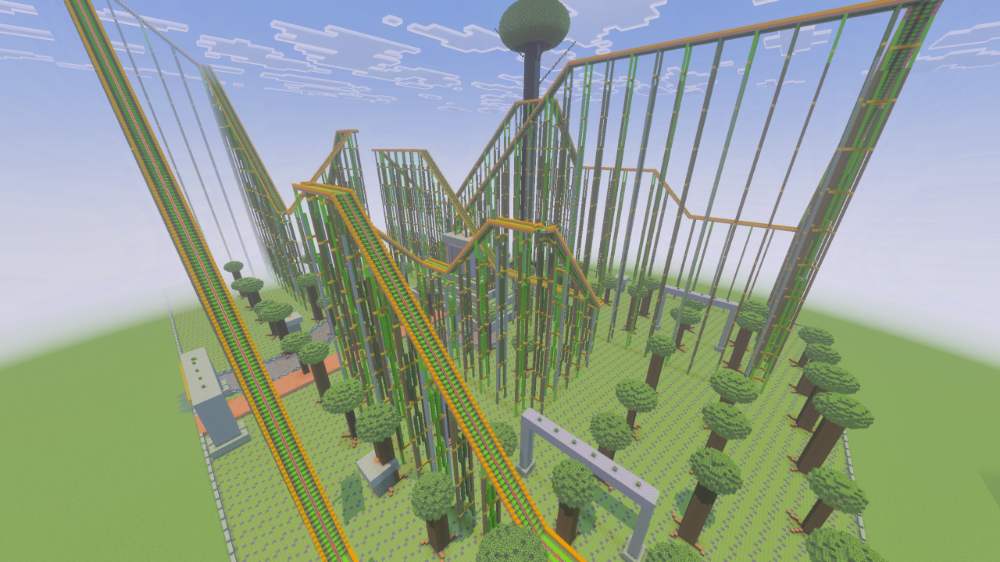
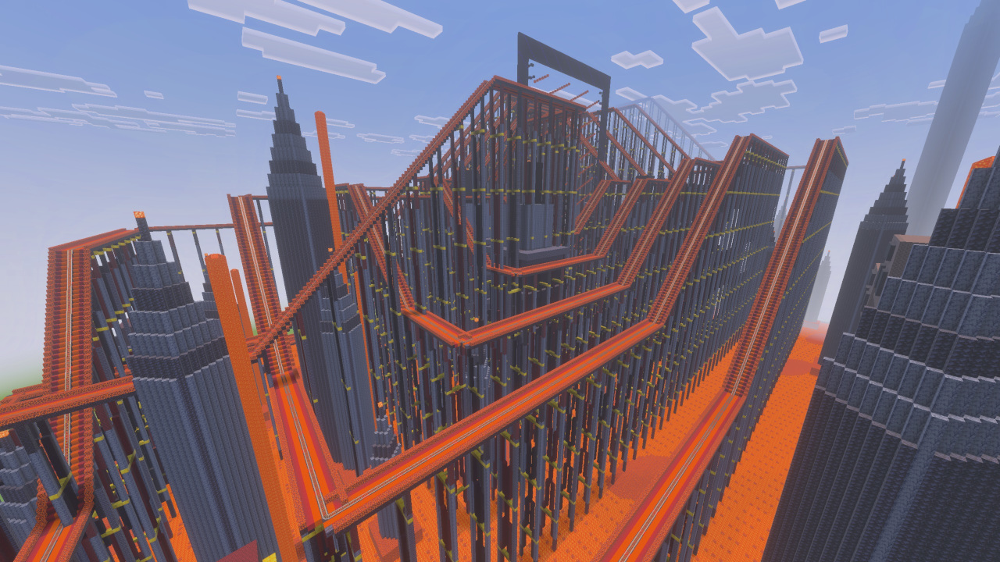
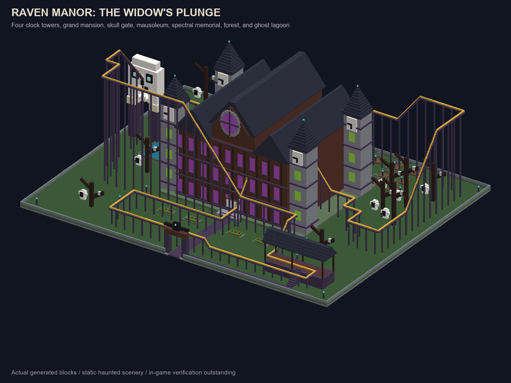
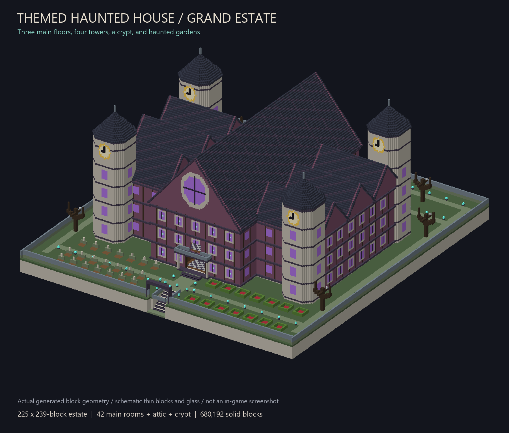

# AI Minecraft Builds

Large language models can generate Minecraft scripts that act as blueprints for buildings and other structures. Describe what you want, ask an LLM for an `.mcfunction` file, and run that function in Minecraft to place the build block by block.

This repository is a collection of those generated blueprints, along with a packaging script that turns them into an `.mcpack` file Minecraft can import.

<p align="center">
  
</p>

<p align="center">
  
</p>

## Example prompt

> build a mcfunction bedrock file for minecraft. make sure to only use bedrock resources. use caret/relative coordinates. commands should build a large, detailed park attraction - roller coaster

## How it works

Minecraft function files are plain-text lists of commands. An LLM can translate a natural-language description into commands such as `fill` and `setblock`, using caret coordinates (`^`) so every block is positioned relative to the player. The result is portable source code for a build: a readable, editable blueprint that Minecraft can execute.

## Huge structure-based roller coasters

The pack includes large, functional roller coasters whose size exceeds Bedrock's 10,000-command function limit. Sparse native `.mcstructure` assets and small loader functions preserve the open spaces between the track and scenery. Jungle Leviathan and Infernal Rift each use 40 assets; Space Adventure and Pharaoh's Curse each use 30.

### Jungle Leviathan

<p align="center">
  
</p>

Jungle Leviathan fills a 460 x 313 x 240-block site with 2,320 connected rails, a temple station, river, stepped ruin, waterfalls, and a giant canopy tree. Build it with `/function theme_park_jungle_leviathan_roller_coaster`, then place a minecart on the station track.

### Infernal Rift

<p align="center">
  
</p>

Infernal Rift is a 460 x 313 x 256-block Nether-themed ride with 4,640 connected rails winding around a bastion station, lava sea, portal cathedral, wither gate, and basalt spires. Build it with `/function theme_park_infernal_rift_roller_coaster`, then place a minecart on the station track.

For either coaster, stand at ground level at the front-center of a clear site, face a cardinal direction, and look horizontally. The nearest blocks begin 48 blocks ahead. Use a disposable world or make a backup: each loader overwrites a huge area and temporarily uses eight of the world's ten command-created ticking areas while its structures load. These areas are removed automatically after placement; wait for one placement to finish before running the same loader again.

### Space Adventure: Odyssey

<p align="center">
  
</p>

Space Adventure takes a continuous minecart circuit from a launch terminal through illuminated ascent hoops, past a lunar crater and orbital outpost, beneath the rings of Aurelia, and through a glowing jump gate. The 352 x 272 x 169-block site has 30 curves, five major climbs, six major drops, a 142-block rail summit, and a separated crossing. The rocket, spacecraft, and planetary scenery are static.

Run `/function theme_park_space_adventure_roller_coaster` from ground level at the front-center observation point, facing a cardinal direction with a horizontal view. The nearest blocks begin 32 blocks ahead; reserve a clear flat site spanning `^-175 ^-1 ^32` through `^176 ^167 ^303`, with your feet at Overworld Y -63 through 152. Follow the lit path to the terminal stairs, place a minecart on the flat station track, and push toward the long lift.

This build places 248,911 non-air blocks and clears 21,828 passenger-corridor cells using 30 structures, a 172-command public loader, and two internal callbacks containing six commands. It needs five free ticking-area slots, released automatically after loading. Back up first or use a disposable world, and wait for placement and cleanup before rerunning it. Rebuild and reimport the pack after changing its source files. See the [route plan, elevation profile, exact metrics, and regeneration instructions](docs/space_adventure/README.md). The image above is a voxel preview, not an in-game screenshot.

### Pharaoh's Curse: The Awakening

<p align="center">
  
</p>

Pharaoh's Curse climbs above a sphinx and obelisk court, drops 82 blocks beside a gold-capped pyramid, and enters its enclosed burial chamber. Glowing-eyed mummy sculptures guard a royal sarcophagus. The escape rises past the queens' tombs, descends through a giant cobra gate, and returns past the oasis to a columned sun temple. The continuous 1,620-rail circuit has 28 curves, four major climbs, three major drops, and an 11-block-separated crossing. All figures and curse effects are static scenery.

Run `/function theme_park_pharaohs_curse_roller_coaster` from ground level at the front-center observation point, facing a cardinal direction with a horizontal view. Reserve a clear, flat **352 x 272 x 101-block** site from `^-175 ^-1 ^32` through `^176 ^99 ^303`; the nearest blocks begin 32 blocks ahead. Stand with your feet at Overworld Y -63 through 220. Follow the guardian avenue and the path to the temple stairs, place a minecart on the station rails, and push toward the lift.

The build places **383,066 non-air blocks** and 121,070 explicit air cells through 30 structures, a 172-command public loader, and six internal callback commands. It needs five free ticking-area slots, released automatically after loading. Back up first or use a disposable world. Rebuild and reimport the pack after source changes, and wait for placement and cleanup before rerunning this loader. The preview shows generated blocks, not an in-game screenshot; in-game testing remains outstanding. See the [route, crypt cutaway, measured dimensions, validation, and regeneration instructions](docs/pharaohs_curse/README.md).

## Raven Manor: The Widow's Plunge

A haunted-house minecart coaster at **Pharaoh's Curse's physical scale: 352 x 272 x 101 blocks**. Its four-clock-tower mansion, ancestor crypt, mirror gallery, giant skull gate, mausoleum, spectral memorial, twisted forest, and ghost lagoon frame a continuous route with 22 curves, four major climbs, three major drops, an 80-block plunge, and an 18-block-separated crossing. Haunted figures, raven, and clock hands are static scenery.

<p align="center">
  
</p>

Run `/function theme_park_haunted_house_roller_coaster` at ground level from the front-center observation point, facing a cardinal direction with a horizontal view. Choose a new clear, flat **352 x 272 x 101-block site**, from `^-175 ^-1 ^32` through `^176 ^99 ^303`; nearest blocks begin **32 blocks ahead**. Stand with your feet at Overworld Y **-63 through 220**. The loader preloads the whole site and needs **five free ticking-area slots**. Follow the right path and eighteen half-block steps to the carriage-house platform, place a minecart on the adjacent flat rail, enter it, and push left toward the ascent.

The build places **386,757 non-air blocks** and 1,111,522 explicit air cells through **30 native structures**, a **174-command public loader**, and six callback commands. Its 1,724 rails reach heights 9 through 93. The scale comparison means the physical envelope and landmark ambition; the route was designed around its haunted scenes. Back up first or use a disposable world. Wait for queued placement and cleanup before rerunning the loader, and rebuild/reimport after source changes. In-game testing remains outstanding; the image is a generated-block preview. See the [route, elevation profile, crypt cutaway, metrics, and regeneration instructions](docs/haunted_house_coaster/README.md).

## Themed Haunted House / Grand Estate

A vast walk-through gothic mansion with **42 furnished main rooms**, six attic spaces, six crypt vaults, twelve accessible tower rooms, and haunted gardens. Three main floors plus the crypt and attic form five connected guest levels. Explore ballrooms, libraries, theaters, laboratories, bedchambers, mirror halls, and observatories. Broad half-block stairs connect the floors; all **76 named destinations and 112 stair treads** pass the walking validator. Scenery and clock-tower belfries are static.

<p align="center">
  
</p>

Run `/function theme_park_themed_haunted_house` at ground level from the front-center observation point, facing a cardinal direction with a horizontal view. Reserve a clear flat **225 x 239 x 98-block site**, from `^-112 ^-1 ^24` through `^112 ^96 ^262`; the nearest blocks start **24 blocks ahead**. Stand with your feet at Overworld Y **-63 through 223**. Climb the new terrace entrance stairs, then follow the path to the porch steps. This estate covers about **10.7 times the original haunted house footprint**.

The build places **680,192 non-air blocks** and 905,324 explicit air cells through **16 native structures**. Its best tested exact cuboid encoding needs **29,980 solid-placement commands**, exceeding the standalone limit. The public loader uses **97 commands**, with four commands across its two internal callbacks. It needs **three free ticking-area slots**, released automatically after loading. Back up first or use a disposable world; the crypt sits inside the raised terrace, so default flat-world ground is supported. Wait for placement and cleanup before rerunning it, and rebuild/reimport the pack after source changes. In-game testing remains outstanding. See the [floor plans, cutaways, metrics, and regeneration instructions](docs/themed_haunted_house/README.md).

## Placement and compatibility details

- Pack version 1.0.25 requires Bedrock 1.21.50 or newer. Its structure loaders use delayed scheduling, introduced in the [1.21.50 release](https://feedback.minecraft.net/hc/en-us/articles/32344904160397-Minecraft-Bedrock-Edition-1-21-50-The-Garden-Awakens).
- Public build functions automatically move the player to the center of their current block, level the view, and snap the yaw to the closest cardinal direction before placing anything. Stand on the ground block that should be the documented origin and face broadly toward the intended north, south, east, or west build direction before running a function.
- The snap removes fractional-position, yaw, and pitch drift that can skew large caret-relative builds. Exact diagonal ties resolve consistently to one of the two neighboring cardinal directions.
- Run public functions as a player. Internal functions whose names begin with `_` are scheduled callbacks and must not be invoked manually.
- LLMs sometimes confuse Bedrock and Java assets or command syntax. After generation, tell the LLM to check that the function uses only resources supported by the Minecraft version you want.
- Generated functions can place many blocks at once. Test new blueprints in a disposable world or make a backup before running them in a world you care about.

## Building the pack

On Windows, double-click `build_ai_minecraft_pack.bat` or run it from a terminal:

```bat
build_ai_minecraft_pack.bat
```

The script validates the manifest, functions, and structures directories, removes an older generated archive if present, creates a ZIP archive, and renames it to `ai-minecraft-builds.mcpack` for import into Minecraft.
