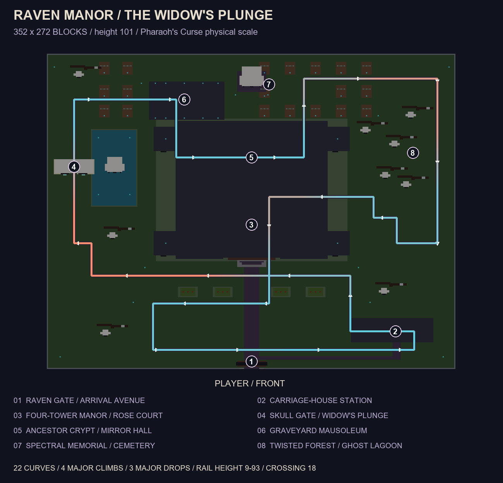
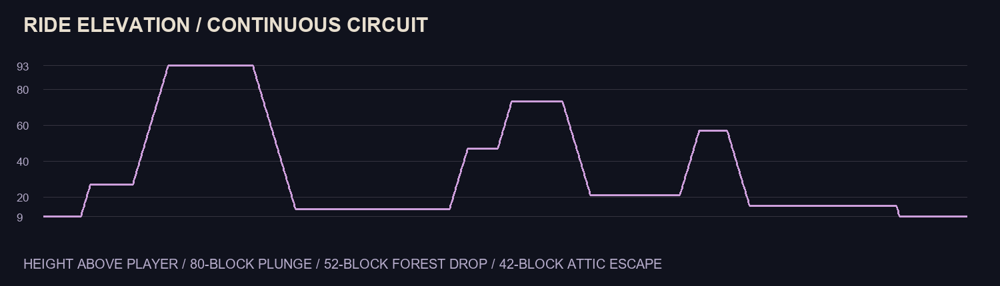
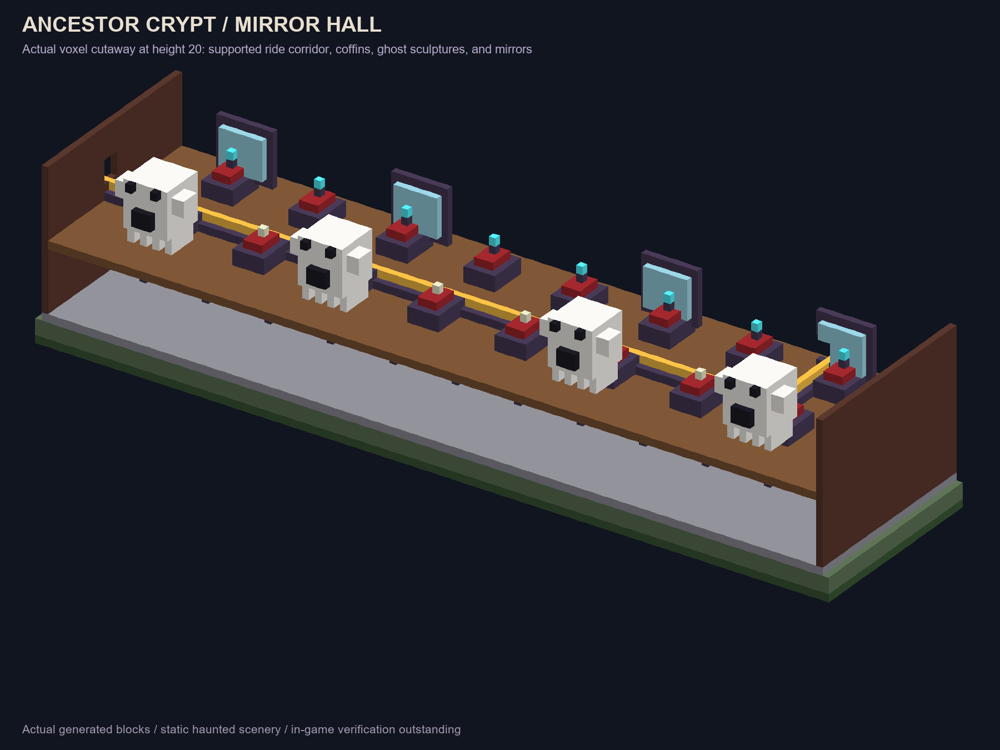

# Raven Manor: The Widow's Plunge

A large functional haunted-house roller coaster at **Pharaoh's Curse's physical
scale: 352 blocks wide, 272 deep, and 101 high**. A four-clock-tower mansion
anchors the composition, with a rose court, ancestor crypt, mirror gallery,
giant skull gate, mausoleum, spectral memorial, twisted forest, and ghost lagoon.
Ghosts, the raven, clock hands, and all haunted scenery are static sculptures.


The comparison means the same physical envelope and comparable landmark
ambition. The ride was redesigned around the haunted scenes, preserving open
courts and broad elevated runs. Track and occupied-block counts follow the
design; they are not numerical scale targets.

## Placement and riding

Import pack **1.0.25 or newer**, enable cheats, and run as a player:

```mcfunction
/function theme_park_haunted_house_roller_coaster
```

Choose a **new clear, flat site** for this enlarged version. Stand at ground
level at the front-center observation point, facing a cardinal direction with
a horizontal view. The function centers the player, levels pitch, and snaps yaw.
Reserve the full **352 x 272 x 101-block** envelope, from `^-175 ^-1 ^32` through
`^176 ^99 ^303`; the nearest blocks begin **32 blocks ahead**. Stand with your
feet at Overworld Y **-63 through 220**. Back up first or use a disposable world.
The loader overwrites the ground, rooms, and passenger corridor; omitted
exterior cells remain untouched, so clear the site before placement.

The full footprint preloads automatically using **five temporary ticking areas**;
five of the world's ten command-created slots must be free. Queued-placement
messages are expected while chunks load. Wait for every section to appear.
Automatic cleanup refreshes to **300 game ticks after each area loads** (15
seconds at 20 TPS), allowing placement to finish after the last area is ready.
Wait for placement and cleanup before rerunning the same loader. If the world
has fewer than five free slots, free areas belonging to your own world setup.

Follow the path right from the raven gate to the carriage-house station.
Eighteen half-block treads reach the boarding platform. Place a minecart on the
adjacent flat powered rail at `^-125 ^9 ^64`, enter it, and push **left while
facing the estate**, toward increasing local left and the clock-tower ascent.
The ride loops continuously; dismount at the station when you want to stop.

## Route and measurements



The route ascends beside the clock towers, plunges 80 blocks through the giant
skull, enters the rear mausoleum and the manor's ancestor crypt, rises beside the
spectral memorial, drops through the twisted forest, and climbs through the
manor's rafters. The escape crosses below the original ascent with 18 blocks
of separation and returns across the rose court to the station.

| Measured property | Raven Manor | Pharaoh's Curse |
| --- | --- | --- |
| Width / depth / height | 352 / 272 / 101 | 352 / 272 / 101 |
| Connected rails | 1,724 | 1,620 |
| Flat curves | 22 | 28 |
| Major climbs / drops, at least 20 blocks | 4 / 3 | 4 / 3 |
| Rail height above player | 9–93 | 8–96 |
| Largest drop | 80 | 82 |
| Crossing separation | 18 | 11 |



The final model has **386,757 non-air blocks** and **1,111,522 explicit air cells**.
It uses **30 native structures**, a **174-command public loader** including the
five snap commands, and **six internal callback commands**. Its direct command
reference has 21,163 executable lines, above the standalone limit. The largest
reference fill has 30,267 cells. The five preload rectangles conservatively
cover **99 / 99 / 99 / 96 / 96 chunks**, including worst-case alignment.



## Generation and validation

```powershell
python -B tools/generate_haunted_house_coaster.py --verify-bedrock
python -B tools/generate_haunted_house_coaster.py --check --verify-bedrock
python -B tools/cardinal_snap.py --check
git diff --check
```

The generator uses `haunted_coaster_geometry.py` for authored scenes and route,
`haunted_coaster_loading.py` for partitioning/loading, and
`haunted_coaster_preview.py` for actual-block projections. It verifies the
continuous loop, supported powered rails, slope/corner approaches, absence of
unintended rail junctions, passenger clearance, accessible boarding platform,
contained lagoon, crypt floor and ceiling, exact physical match to the reference,
bounds, fill sizes, and command limit. It parses and replays every geometry
command, parses every asset as little-endian NBT, and compares the complete
voxel/material map under every cardinal structure placement. It checks every
world-chunk alignment of each preload rectangle and all rotated rail states.
`--check` compares the three functions, 30 assets, and metrics byte for byte.

All block identifiers and explicit states are checked against [Mojang's Bedrock
1.21.50.7 metadata](https://github.com/Mojang/bedrock-samples/blob/v1.21.50.7/metadata/vanilladata_modules/mojang-blocks.json).
The official [structure](https://learn.microsoft.com/en-us/minecraft/creator/commands/commands/structure?view=minecraft-bedrock-stable),
[tickingarea](https://learn.microsoft.com/en-us/minecraft/creator/commands/commands/tickingarea?view=minecraft-bedrock-stable),
and [schedule](https://learn.microsoft.com/en-us/minecraft/creator/commands/commands/schedule?view=minecraft-bedrock-stable)
references explain the loading lifecycle.

See [metrics.json](metrics.json) for the complete inventory and asset dimensions.
Images show generated blocks, not in-game screenshots. **In-game testing remains
outstanding**, including a full ridden circuit and placement in all four facings.

Rebuild with `build_ai_minecraft_pack.bat` and reimport after changing packaged
source. The archive must include the public loader, both underscore-prefixed
callbacks, and all 30 namespaced structures. Do not run internal callbacks
manually. Source generators, metrics, and previews remain outside the pack.
