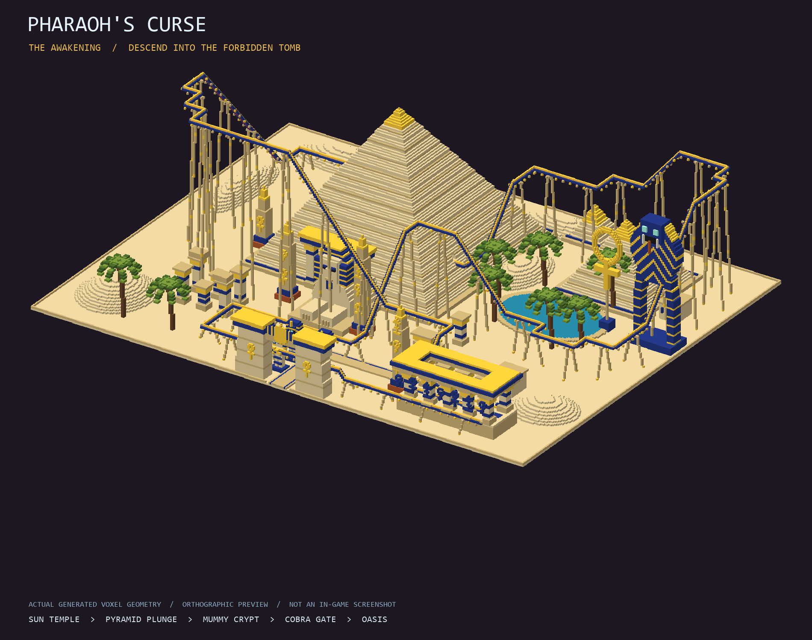
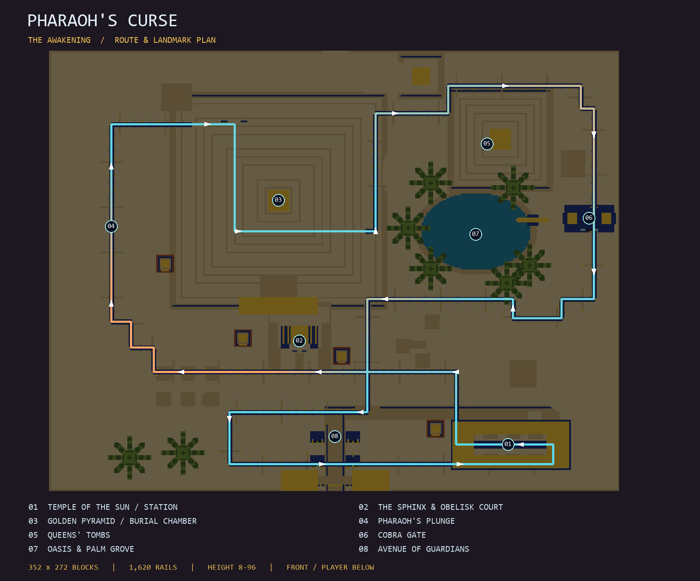
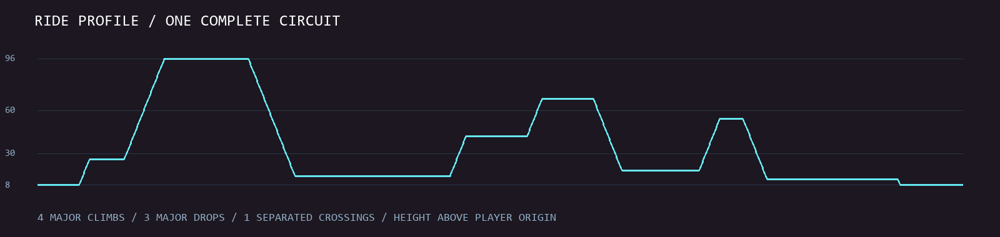
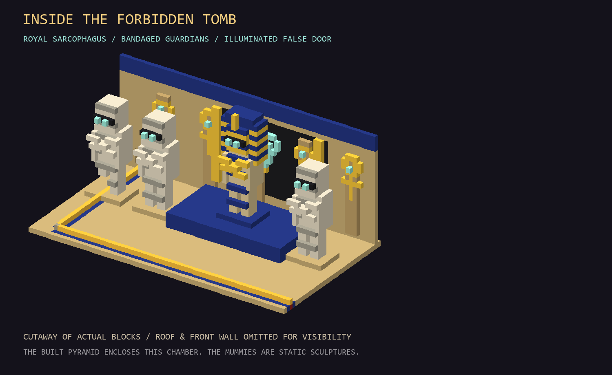

# Pharaoh's Curse: The Awakening

A complete Bedrock minecart circuit through a monumental Egyptian necropolis. The warm sandstone, lapis blue, and gold palette ties the architecture, sculptures, and elevated track together. Turquoise eyes and lighting mark the curse scenes.



The images in this folder render the actual generated block map. They are neither concept art nor in-game screenshots. The crypt image removes the roof and front wall for visibility; the built pyramid encloses the chamber.

## Build and ride

1. Import the repository-root `ai-minecraft-builds.mcpack` and activate the behavior pack in a disposable world, or back up your world. Enable cheats. Pack version **1.0.19** requires **Bedrock 1.21.50+**.
2. Choose a clear, flat Overworld site. Stand at the front-center observation point at ground level, with your feet at Y **-63 through 220**, face a cardinal direction, and look horizontally. The function centers your position and snaps your facing automatically.
3. Run `/function theme_park_pharaohs_curse_roller_coaster` as a player.
4. Wait for structure placement. The loader needs **five free ticking-area slots**. Cleanup runs 300 ticks after the last area-loaded callback, approximately 15 seconds at normal tick rate. Wait for placement and cleanup before running the same function elsewhere.
5. Walk through the winged-sun entrance along the guardian avenue, turn toward the sun temple, and climb its broad stairs. Place a minecart on the flat station rails near `^-120 ^8 ^60` relative to the original build position, board, and push toward increasing local left, toward the departure lift.

The ride is a continuous powered circuit. Mummies, the cobra, the sphinx, and the supernatural effects are static block sculptures. No custom entities, resource pack, moving scenery, or experimental toggles are required. Dismount at the station to finish; there is no automatic dispatch or station stop.

## Site and measured geometry

| Measurement | Value |
| --- | --- |
| Reserved volume, including air clearance | 352 wide x 272 deep x 101 high |
| Caret bounds | `^-175 ^-1 ^32` through `^176 ^99 ^303` |
| Nearest blocks | 32 blocks forward of the player |
| Highest non-air block | `^96` above the player |
| Rail elevations | 8 through 96 blocks above the player |
| Main pyramid | 129 x 129 actual shell footprint; 82 layers; 135 x 135 plinth |
| Rail circuit | 1,620 rails: 1,592 powered straights/slopes and 28 flat curves |
| Major climbs / drops | 4 / 3; a major change is at least 20 consecutive vertical blocks |
| Major climb sizes | 70, 28, 26, 36 blocks |
| Major drop sizes | 82, 50, 42 blocks |
| Separated crossing | Local left -20, forward 105, rail heights 23 and 34 |
| Non-air blocks, including water and rails | 383,066 |
| Explicit air cells | 121,070, including 16,360 rail-corridor cells |
| Native structures | 30; 40,349,432 uncompressed bytes |
| Public loader commands | 172, including the five cardinal-snap commands |
| Callback commands | 1 area-loaded command + 5 cleanup commands; 178 total |
| Smallest exact single-axis run encoding | 44,083 commands; native structures avoid the function limit |

The scale is a comparable physical footprint to Space Adventure, with lower track and greater architectural emphasis. Track length follows the scenes; it has no ratio or block-count target. The pyramid courtyard, oasis, and dunes remain open. Sparse omitted structure cells preserve unrelated world blocks; explicit air clears the rail corridor, crypt, and selected interiors. This is why a clear site is required.

## Ride sequence



1. **Temple of the Sun.** A skylit columned station, blue and gold cornices, broad stairs, a guardian avenue, and a winged sun gateway establish the arrival scene.
2. **Sun ascent.** The track climbs past the sphinx, obelisks, and broken hypostyle court to a 96-block summit, with the great pyramid ahead.
3. **Pharaoh's plunge.** An 82-block descent runs beside the pyramid before turning into the lower tomb passage.
4. **Burial chamber.** The rail passes a golden royal sarcophagus, three wrapped mummies with crossed arms, reliefs, and a luminous false door inside the pyramid. All figures have open space in front of them for the riders.
5. **Escape from the tomb.** The track climbs through the western shell and turns above the smaller queens' pyramids, revealing the oasis and cobra.
6. **Cobra gate.** A 50-block descent passes through the giant cobra's lower aperture beside a gold ankh monument.
7. **Sphinx return.** A further climb and 42-block drop pass the palm oasis and frame the sphinx before crossing beneath the earlier ascent with 11 blocks of separation.
8. **Home to the temple.** The low circuit passes the guardian avenue and returns to the flat station track.





## Regenerate and validate

From the repository root, with Python 3.10+ and Pillow:

```powershell
python tools/generate_pharaohs_curse.py
python tools/generate_pharaohs_curse.py --check
python tools/cardinal_snap.py --check
.\build_ai_minecraft_pack.bat
```

`--preview-only` reconstructs the scene, validates its route and geometry, and renders images without writing structure or function files. `--check` reconstructs the entire voxel map, parses every saved structure, and compares functions and metrics without rewriting them. The generator reuses the existing Jungle Leviathan slope builder and Skyline Cyclone NBT/rail-state helpers; scenery and route are authored separately for this attraction.

The generator checks every rail's adjacency, flat corner approaches, powered support, unrelated neighboring rails, passenger clearance, crossing separation, station stairs, entrance walkway, pool floor and banks, mummy eyes, pyramid capstone, and crypt enclosure. It parses all NBT assets through the final byte and compares every decoded block and state to the source. It simulates all four cardinal chunk rotations and all four rail-state rotations, verifies complete preload coverage, and validates every loader command and the exact callback contents. See [metrics.json](metrics.json) for measured results and per-asset dimensions.

Five nonoverlapping preload rectangles cover the site: three 117/118 x 159 rectangles and two 176 x 113 rectangles. Each can touch at most 99 or 96 chunks under adverse alignment. Loading can fail if five of the world's ten command-created ticking areas are not free. Cleanup removes only names beginning `pharaohs_curse_`; unrelated areas are left intact.

All generated functions use LF. The root README and manifest preserve their existing CRLF. The pack contains the public function, exactly two underscore-prefixed callbacks, and every namespaced asset. Source code, metrics, and images remain outside the behavior pack. Rebuild and reimport after any packaged source changes.

Static checks and generated previews passed. **An in-game ride test has not been performed.** After import, check actual rail updates and a complete circuit in a disposable world, including each cardinal orientation and the enclosed crypt. Static validation cannot reproduce Minecraft's runtime behavior.

## Compatibility references

All palette identifiers were checked against the [official Bedrock block listing](https://github.com/MicrosoftDocs/minecraft-creator/blob/main/creator/Reference/Content/VanillaListingsReference/Blocks.md). Rails use `minecraft:golden_rail` with `rail_data_bit` and `rail_direction`; water uses `liquid_depth`.

The loader follows the official [structure command](https://learn.microsoft.com/en-us/minecraft/creator/commands/commands/structure?view=minecraft-bedrock-stable), [schedule command](https://learn.microsoft.com/en-us/minecraft/creator/commands/commands/schedule?view=minecraft-bedrock-stable), and [ticking-area preload guidance](https://learn.microsoft.com/en-us/minecraft/creator/documents/tickingareacommand?view=minecraft-bedrock-stable). Delayed scheduling was introduced in the [Bedrock 1.21.50 release](https://feedback.minecraft.net/hc/en-us/articles/32344904160397-Minecraft-Bedrock-Edition-1-21-50-The-Garden-Awakens), so the manifest now declares that minimum version.
