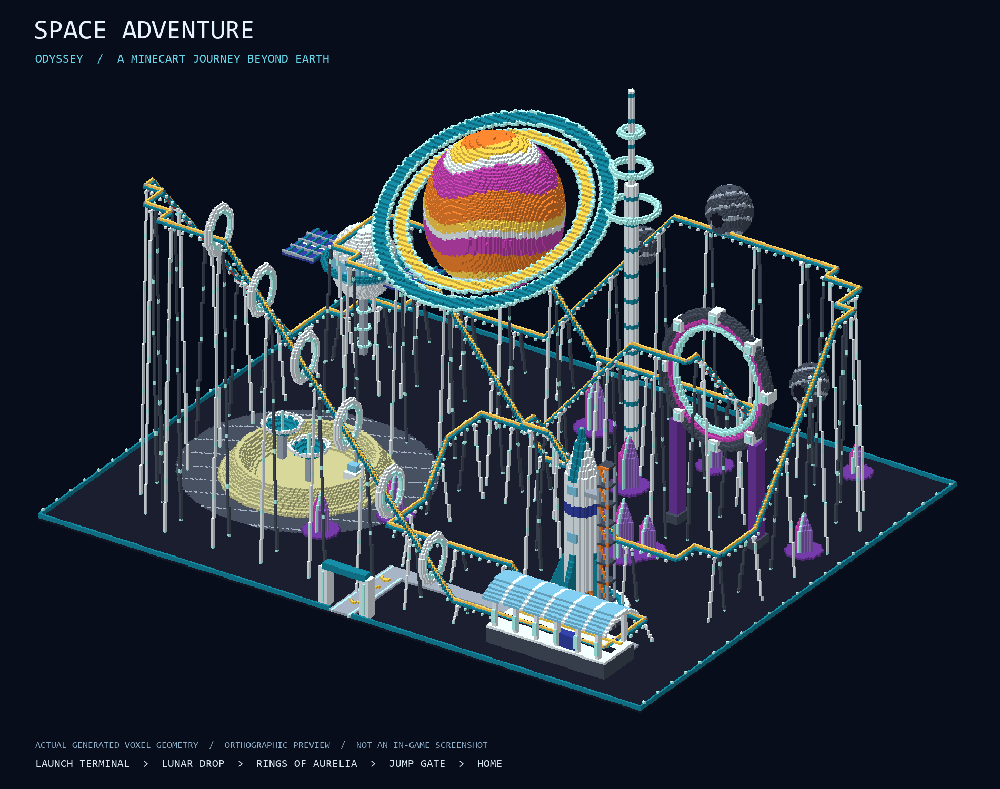
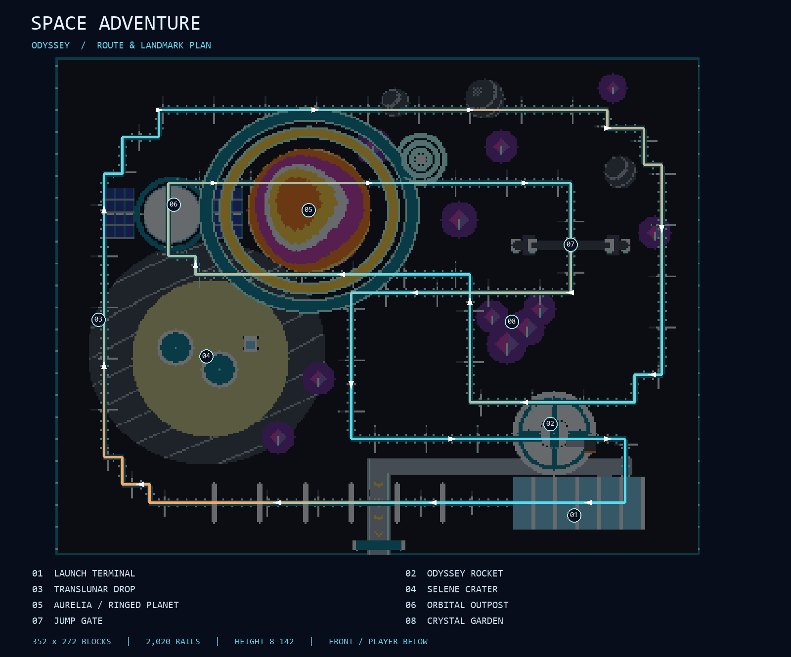
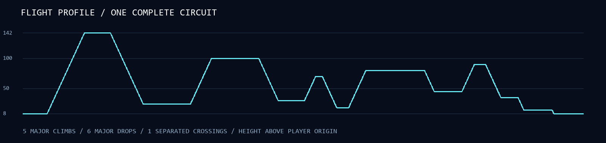

# Space Adventure: Odyssey

A minecart expedition from a launch terminal to the rings of Aurelia and back through a jump gate. White aerospace structures, cyan navigation lights, orange planetary bands, and amethyst terrain give the ride a recognizable space theme in daylight; sea lanterns outline the route after dark.



## Build and ride

Rebuild and import `ai-minecraft-builds.mcpack`, activate the behavior pack in a creative Overworld with cheats enabled, and run:

```mcfunction
/function theme_park_space_adventure_roller_coaster
```

Stand at ground level at the front-center observation point and face a cardinal direction with a horizontal view. The function centers and levels you automatically. Use a clear, flat **352 wide x 272 deep x 169 high** site, starting **32 blocks ahead**. The relative bounds are `^-175 ^-1 ^32` through `^176 ^167 ^303`. Your feet must be at world Y **-63 through 152**; an ordinary low-altitude flat Overworld is suitable.

Follow the lit entrance path to the launch terminal and ascend the eight broad steps. Place a minecart on the flat station rail at approximately `^-120 ^8 ^60`, board, and push toward the long lift (positive local left). The continuous powered circuit returns to the station. There is no automatic station brake; dismount when you want to finish. The rocket, rings, asteroids, and jump gate are static scenery; no simulated zero gravity or vertical rail loops are claimed.

Back up your world or use a disposable test world. This build overwrites its occupied cells and explicitly clears its passenger corridor. Other absent structure cells remain void, so trees and hills elsewhere are not automatically removed. Leave **five command-created ticking-area slots free**. The loader removes its own areas 300 ticks after the last area-loaded callback; wait for placement and cleanup before invoking this same build elsewhere. Cleanup removes no other build's areas.

## Ride design

The layout reserves three substantial open spaces: the rocket forecourt, Selene's crater, and the orbital court beneath Aurelia. Short stepped bends create wider changes of direction using Bedrock's flat corner rails. The route does not use dense serpentine rows to inflate its length.

| Scene | What the rider encounters |
| --- | --- |
| Launch terminal | Swept glass canopy, mission-control booth, boarding platforms, and an accessible stair approach |
| Odyssey launch | An 87-block rocket with engines, four fins, portholes, and a braced service gantry; six illuminated launch hoops along the climb |
| Translunar drop | A 118-block descent beside the lunar basin after the 142-block summit |
| Selene crater | A raised irregular-looking rim, two parabolic radio dishes, and a small exploration rover |
| Rings of Aurelia | A 69-block-diameter striped planet with tilted concentric rings and a visible gap; track approaches its front and passes below it |
| Orbital outpost | A glazed spherical hub with gridded solar wings and docking-height track |
| Jump gate | A luminous 65-block-wide circular aperture aligned with the climbing track |
| Homeward run | An elevated crossing over an earlier dive, crystal formations, and a low return to the launch terminal |





## Measured build

| Metric | Value |
| --- | --- |
| Site | 352 x 272 blocks |
| Total height | 169 blocks, including the foundation |
| Rail heights above the player origin | 8-142 blocks |
| Route | 2,020 connected rails: 1,990 powered, 30 curved |
| Major elevation changes | 5 climbs and 6 drops of at least 20 blocks |
| Crossing | One, with 48 blocks between rail levels |
| Blocks | 248,911 non-air blocks plus 21,828 explicit air cells |
| Representation | 30 sparse native `.mcstructure` assets |
| Commands | 172 in the public wrapper; 6 across two internal callbacks; 178 total |
| Best exact axis-run encoding | 50,531 commands; native structures avoid the function limit |
| Temporary preload areas | Five: three at most 99 chunks, two at most 96 chunks |

The full material inventory, per-asset dimensions, byte sizes, and checks are recorded in [metrics.json](metrics.json). Counts describe placed geometry, not an artificial target used to choose the route.

## Regeneration and validation

From the repository root, use Python 3.10 or newer with Pillow installed:

```text
python -B tools/generate_space_adventure.py
python -B tools/generate_space_adventure.py --check
python -B tools/cardinal_snap.py --check
git diff --check
```

The generator reuses the repository's little-endian NBT encoder/decoder, rail-state calculation, and slope profile. It owns the new layout, scenery, support geometry, loader, validation, and voxel renderer. `--preview-only` builds and checks the geometry and renders the three PNGs without writing package assets. `--check` reconstructs the design and compares every packaged block/material map, function, and metrics report without rewriting the outputs.

Checks cover the closed route, one-block slope limit, flat approaches at every curve, powered support under every rail, unintended adjacent rail connections, passenger clearance, stair access, chunk partition occupancy, complete NBT consumption, both block-index layers, all four rotated voxel maps, rotated rail states, exact preload coverage, namespaced assets, callback lifecycle, and the cardinal snap. No `fill` commands are emitted by this loader.

The previews are generated from the actual final voxel dictionary, with colors approximating vanilla blocks. They are not Minecraft screenshots. Static checks cannot establish minecart behavior or queued placement timing in the game; an in-game ride in all four orientations remains the final acceptance check.

## Bedrock references

The loader uses the official [structure load syntax and rotations](https://learn.microsoft.com/en-us/minecraft/creator/commands/commands/structure?view=minecraft-bedrock-stable), [area-loaded and delayed scheduling](https://learn.microsoft.com/en-us/minecraft/creator/commands/commands/schedule?view=minecraft-bedrock-stable), and [named preloaded ticking areas](https://learn.microsoft.com/en-us/minecraft/creator/commands/commands/tickingarea?view=minecraft-bedrock-stable). Vanilla identifiers and state names are checked against Microsoft's [block listing](https://learn.microsoft.com/en-us/minecraft/creator/reference/content/vanillalistingsreference/blocks?view=minecraft-bedrock-stable); only established blocks already available in Bedrock 1.21 are used.
