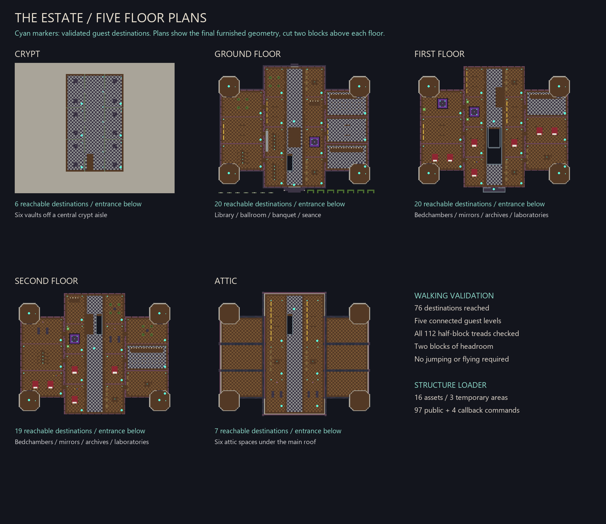
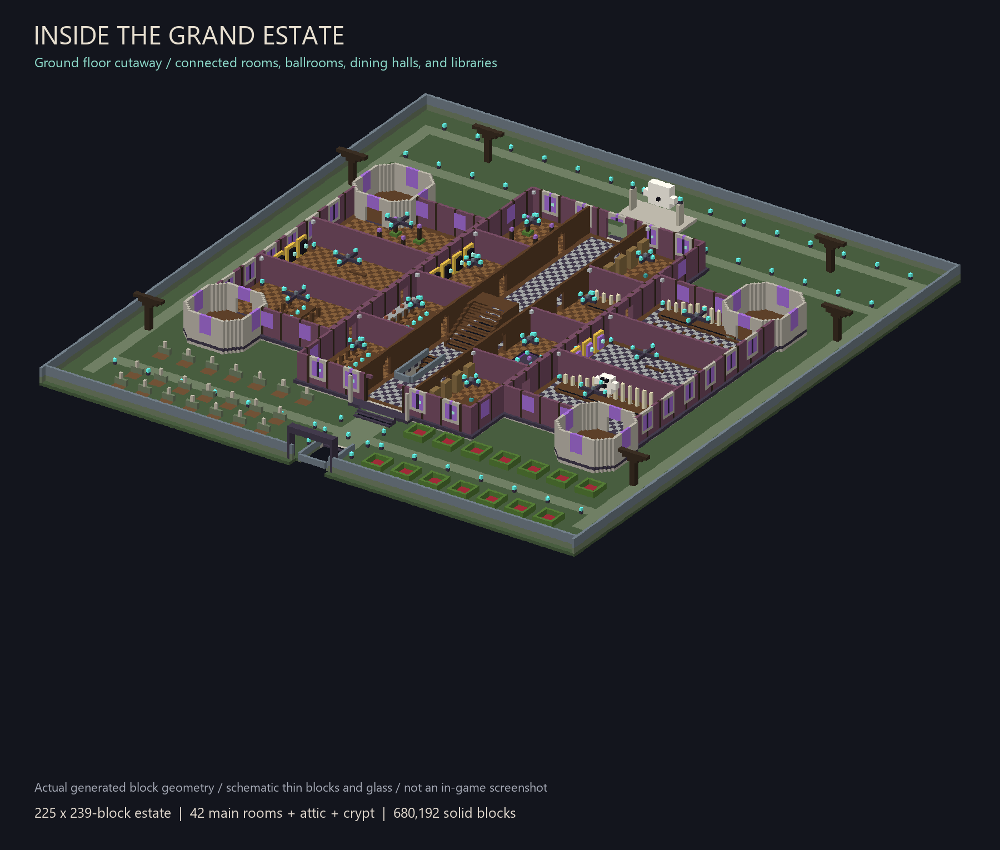
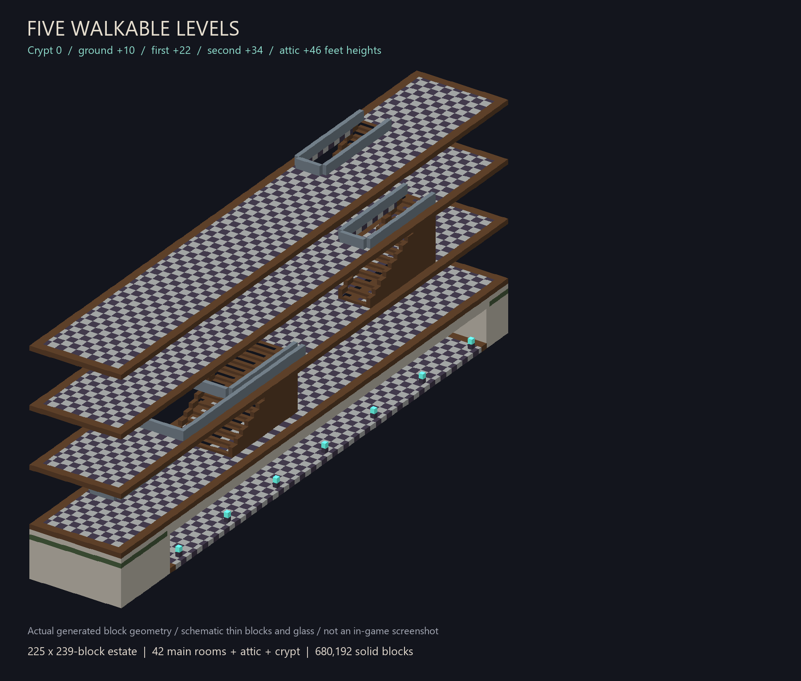

# Themed Haunted House / Grand Estate

A sprawling gothic estate with **42 furnished main rooms**, **six attic spaces**, **six crypt vaults**, and **twelve accessible tower rooms**. Five connected guest levels, four clock towers, six projecting wing sections, a cemetery, a rose-knot garden, and a rear ghost memorial fill a **225 x 239-block** footprint: about **10.7 times the original**.


Previews depict actual generated geometry with schematic materials. Thin blocks and transparent glass are simplified; these are not in-game screenshots.

## Place and enter

Version **1.0.22** fixes the flat-world no-placement failure. The old loader started every structure nine blocks below the player; on default flat ground this put the entire structure bounding box below the Overworld limit. The estate now loads from one block below your feet, with its crypt enclosed in a raised terrace and a walkable entrance ramp. The new loader displays a v1.0.22 loading message so you can confirm the updated pack is active.


Import the rebuilt `ai-minecraft-builds.mcpack` version **1.0.22**, activate the behavior pack, and enable commands in a disposable or backed-up Bedrock world. Reserve a clear flat site spanning `^-112 ^-1 ^24` through `^112 ^96 ^262`, using `^left ^up ^forward`. It is **225 blocks wide, 239 deep, and 98 high**, including a one-block-deep foundation; the crypt fits inside an eight-block terrace. Stand with your feet at Overworld Y **-63 through 223**.

Stand at ground level at the **front-center observation point**, face a cardinal direction, and look horizontally. Run:

```text
/function theme_park_themed_haunted_house
```

The function centers your position and snaps your view before building. Nearest blocks begin **24 blocks ahead**; the entrance is at `^0 ^10 ^72`. Wait for placement, climb the terrace entrance stairs, and follow the broad approach to the porch steps. The same public function name now builds the large estate.

This overwrites a large site and builds an eight-block retaining foundation. Use a fresh clear site: sparse exterior cells do not erase tall terrain or an older build. Interior rooms and ground-level walking clearance contain explicit air.

## Explore five levels

The ground floor includes a whispering library, séance salon, music room, ghost banquet, abandoned kitchen, poison conservatory, grand ballroom, mirror hall, funeral theater, armor gallery, and winter orangery. The upper floors add bedchambers, nurseries, archives, long libraries, laboratories, theaters, observatories, and relic collections. Parquet and stone dance floors, overhead beams, lighting, furniture, and open arches distinguish the interiors. Ballrooms retain open dance floors.

The **13-block-wide grand staircase** reaches the first-floor landing. Follow the central hall rearward for the second-floor stair, then take the adjacent upper flight into the attic. The crypt stair descends from the entrance hall into an aisle linking six burial vaults. Tower rooms connect through inward-facing arches on all three main floors. The first-floor balcony overlooks the approach.

Guest feet heights are **0, +10, +22, +34, and +46**; the grounds are at +8. Half-block treads and guarded stair openings allow walking without jumping or flying. All **76 named destinations** and **112 stair treads** pass the geometry validator. Upper belfries, clock faces, spires, ghosts, and effects are static. Furniture is block-built; there are no ride vehicles, animated scares, hostile-mob scripts, or functional beds.







## Structure loading

The model has **680,192 non-air blocks** plus **905,324 explicit air cells**. The best of six tested exact, non-overlapping cuboid encodings needs **29,980 solid-placement commands**, before air clearance and cardinal snap. This exceeds the 10,000-command standalone limit. It is a measured compression result, not a theoretical minimum across every possible command strategy.

The build uses **16 namespaced `.mcstructure` assets** and exactly three functions:

- `theme_park_themed_haunted_house`: public loader, **97 commands** including five snap commands.
- `_theme_park_themed_haunted_house_tickingarea_loaded`: one command to schedule cleanup.
- `_theme_park_themed_haunted_house_remove_tickingarea`: three commands to remove this estate's areas.

The complete lifecycle uses **101 commands**. The wrapper clears stale callbacks, preloads the estate, and places structures in the player's build context. Never invoke the underscore-prefixed callbacks manually.

The loader needs **three free ticking-area slots** out of the world's ten. Three adjacent rectangles cover the site, each touching at most **90 chunks** under worst-case alignment. Three is the minimum number of 100-chunk areas for this footprint. Existing areas can prevent loading if fewer than three slots remain. Queued placements finish when chunks load; cleanup refreshes to **300 ticks** after each area becomes ready. Wait for placement and cleanup before rerunning this loader. Rebuild and reimport the pack after source changes.

## Regeneration and validation

Use Python 3.10 or newer with Pillow, from the repository root:

```text
python -B tools/generate_themed_haunted_house.py --verify-catalog
python -B tools/generate_themed_haunted_house.py --check
python -B -m unittest discover -s tools -p test_haunted_house_height.py
python -B tools/cardinal_snap.py --check
git diff --check
```

`tools/haunted_house_geometry.py` defines architecture and furnishings. The generator reuses the repository's little-endian NBT codec and emits all assets, functions, previews, and [computed metrics](metrics.json). `--check` rebuilds the model in memory and compares every saved asset, function, and metric without rewriting files.

Validation checks two-block headroom and a maximum half-block walking step, every stair tread, exact cuboid reconstruction, all NBT fields and block-index layers, full voxel/material equality after decoding, every placement anchor in all four cardinal directions, preload coverage, command syntax, and line endings. Regression tests check all 80 cardinal load commands at six ground heights, including Y -60, and reject the former -9 placement offset. Identifiers and explicit states are verified against [Mojang's Bedrock 1.21.50 catalog](https://github.com/Mojang/bedrock-samples/blob/v1.21.50.7/metadata/vanilladata_modules/mojang-blocks.json). Block-palette version 1.21.30.7 matches [Microsoft's exported structure sample](https://github.com/microsoft/minecraft-samples/blob/main/chill_oasis_blocks_and_features/chill_oasis_biome/behavior_packs/chill_oasis_biome/structures/mike/palm_tree_large.mcstructure) and supports split wooden-slab identifiers.

Loading follows the official [structure](https://learn.microsoft.com/en-us/minecraft/creator/commands/commands/structure?view=minecraft-bedrock-stable), [tickingarea](https://learn.microsoft.com/en-us/minecraft/creator/commands/commands/tickingarea?view=minecraft-bedrock-stable), and [schedule](https://learn.microsoft.com/en-us/minecraft/creator/commands/commands/schedule?view=minecraft-bedrock-stable) command forms.

**In-game testing remains outstanding.** A Bedrock playthrough should verify all four facings, queued loading, thin blocks and glass, lighting, and movement. Static validation cannot confirm those engine behaviors.
